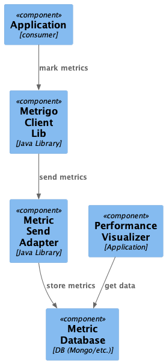

# Metrigo

The intent of this library is to allow for real time data gathering on performance metrics.
The assumption is that authors of code know best what needs to be measured, and if they do not,
they can use this library to drill down slowly.

