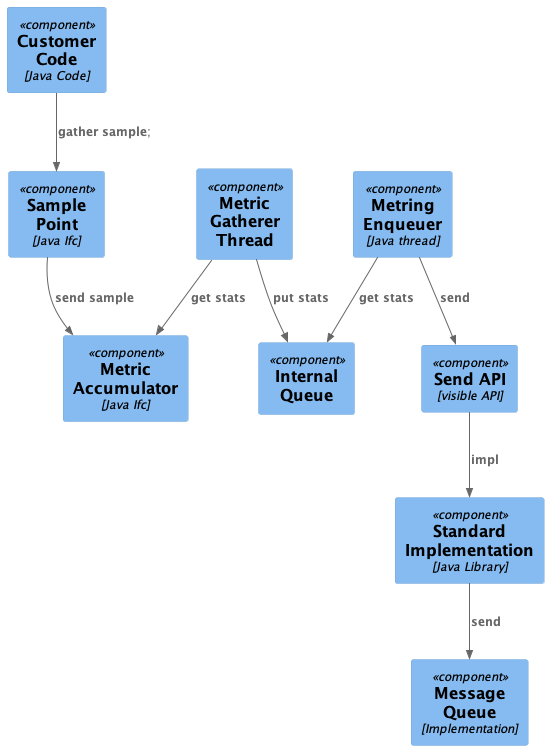

# Metrigo

Metrics gathering software really should be opinionated, and designed to gather statistics that are both easy to aggregate and useful for visualization. This library tries to be all of those things.

# Quick Start

FIXME: Need quick start.

# Background

When we gather metrics for software, there is a need to get detailed information that can be aggregated. This means that we should base our gathering on a few principles.
1. Only use metrics that can be aggregated
2. Use sensible and consistent time segmentation.
3. Balance accuracy with dynamic range.

To satisfy these principles, we chose the following.
1. Logarithmically scaled bins (by sqrt(10))
   1. gives good accuracy for the bin range.
   2. gives large dynamic range
2. Consistent bins (3 microseconds to 1000 seconds)

## Details

Each bin is a multiplier of sqrt(10), meaning about a factor of three.

FIXME: need some statistical analysis here.

# Overview

The over all architecture is:

## Client Library Architecture

